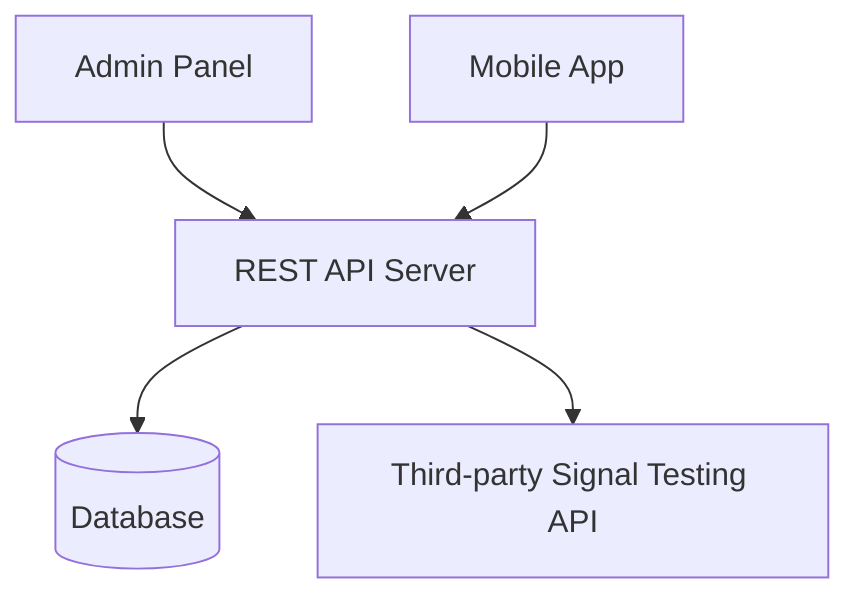
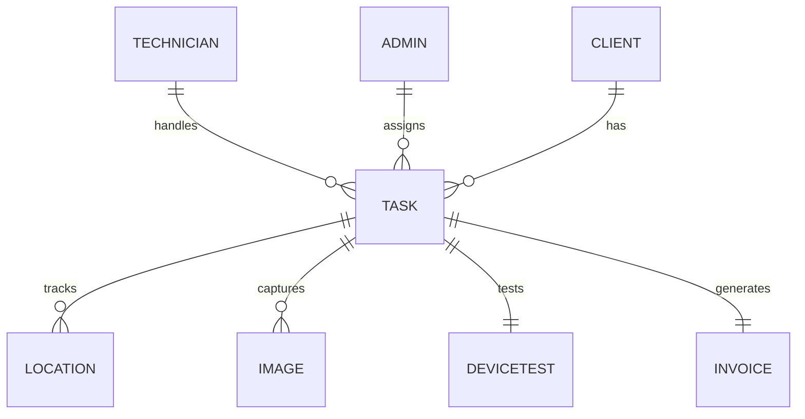

# Mobile App Design Document

## Overview

This document provides a comprehensive overview and design for the mobile application based on the Software Requirements Specification (SRS). The app is designed for field technicians of a tracking company to manage vehicle tracker installation jobs efficiently.

## System Architecture

### Mobile App Architecture
- **Framework**: Flutter (Cross-platform)
- **Local Database**: SQLite for caching
- **Background Services**: Location tracking
- **Authentication**: JWT tokens

### Backend Architecture
- **API**: REST-based
- **Admin Panel**: Web-based job assignment
- **Signal Testing**: Integration with third-party device APIs

## Key Features

### 1. User Authentication
- Technician login with email/phone and password
- Password reset functionality

### 2. Job Management
- **Job Types**:
  - Installation 248
  - Removal 248
  - Redo 248
  - Removal transfer 248
  - Transfer Installation 248
  - Inspections 248

- **Job Actions**:
  - Accept or reject job assignments
  - View client details and GPS location
  - Track job status (Pending, Accepted, Rejected, Completed)

### 3. Location Tracking
- Real-time location tracking every 10 seconds
- Location data sent to server for monitoring

### 4. Vehicle Verification
- Capture vehicle photos
- View device serial and model details

### 5. Signal Testing
- Remote device connectivity testing
- Instant feedback on device status

### 6. Inventory Management
- Inventory from 214/248 pushed to technician app
- Device acknowledgment for various inventory items:
  - Device Device
  - OBO-I/OBO-II
  - Tape, Relay, Tie clip, Wire thimble
  - Tool bag, Tools
  - Cap, Uniform

### 7. Invoice Generation
- Automatic invoice generation upon job completion
- Includes technician details, job info, and amount

## User Roles

### Technician
- Receive and manage job assignments
- Navigate to client locations with GPS
- Perform installation/removal/inspection tasks
- Capture vehicle images
- Test device signals
- Update job status and generate invoices

### Admin
- Assign jobs to technicians
- Monitor technician activities and locations
- Manage client and device data
- View reports and invoices

## Data Flow

## Entity-Relationship Diagram

### Entities

1. **Technician**: TechnicianID (PK), Name, Phone, Email
2. **Admin**: AdminID (PK), Name, Email
3. **Client**: ClientID (PK), Name, Address, Phone, VehicleDetails
4. **Task**: TaskID (PK), ClientID (FK), TechnicianID (FK), Status, AssignmentDate
5. **Location**: LocationID (PK), TaskID (FK), Latitude, Longitude, Timestamp
6. **Image**: ImageID (PK), TaskID (FK), ImageURL, UploadDate
7. **DeviceTest**: TestID (PK), TaskID (FK), TestStatus, TestDate
8. **Invoice**: InvoiceID (PK), TaskID (FK), Amount, IssueDate, Status

## Technical Requirements

### Performance
- Location sync every 10 seconds with <2s delay
- Server responses within 5 seconds

### Reliability
- Offline caching for job data when internet is unavailable

### Security
- Data encryption
- JWT token-based authentication

### Usability
- Intuitive navigation with clear icons and steps

### Compatibility
- Android 8.0+
- iOS 12+

## Non-Functional Requirements

1. **Scalability**: System should handle multiple technicians and jobs simultaneously
2. **Availability**: 99.9% uptime for job assignments and tracking
3. **Maintainability**: Modular design for easy updates and feature additions
4. **Portability**: Cross-platform compatibility (Android and iOS)

## Budget Estimate

| Component | Estimated Cost (PKR) | Details |
|-----------|---------------------|---------|
| UI/UX Design | 50,000 | Wireframes, prototypes, responsive design |
| Mobile App Development | 300,000 | Flutter development with all core features |
| Backend Development (API) | 50,000 | REST APIs, location, image, and signal handling |
| Admin Panel (Web Dashboard) | 50,000 | Job assignment, monitoring, invoice records |
| Database Design & Setup | - | SQL Server / PostgreSQL |
| QA & Testing | - | Manual testing, bug fixing |
| Project Management / Documentation | - | SRS, reports, delivery milestones |
| **Total** | **450,000 - 500,000 PKR** | |

## Implementation Roadmap

1. **Phase 1**: Core Authentication and Job Management
   - User login/logout
   - Job listing and acceptance
   - Basic dashboard

2. **Phase 2**: Location Tracking and Vehicle Verification
   - GPS tracking implementation
   - Photo capture functionality
   - Device information display

3. **Phase 3**: Signal Testing and Invoice Generation
   - Device testing integration
   - Automatic invoice generation
   - Job completion workflow

4. **Phase 4**: Inventory Management and Reporting
   - Inventory tracking features
   - Admin panel development
   - Reporting and analytics

## Conclusion

This design document provides a comprehensive overview of the mobile application based on the requirements specification. The app will streamline vehicle tracker installations by providing real-time job assignment, status tracking, and automated invoicing. The Flutter-based cross-platform approach ensures compatibility across devices while maintaining a consistent user experience.